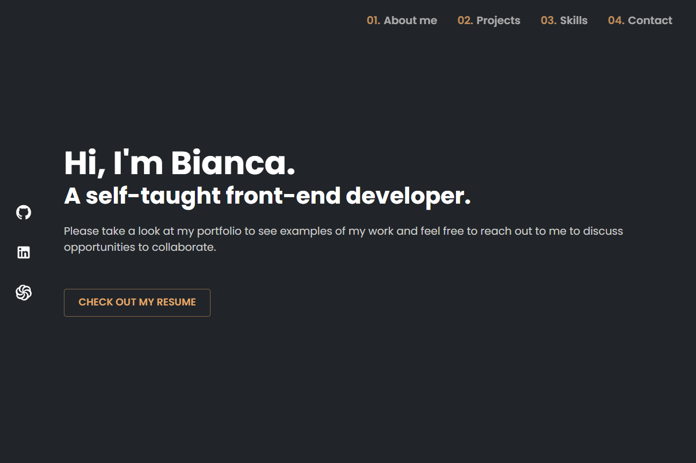
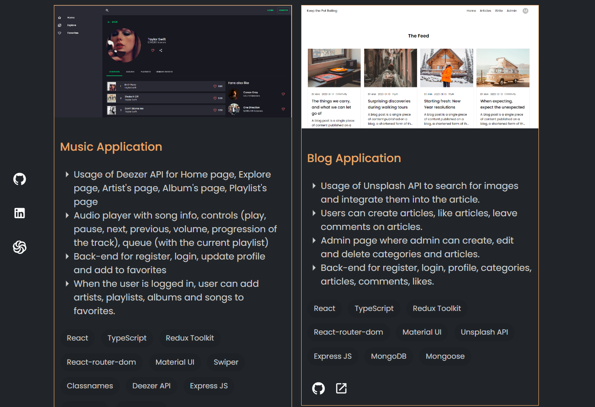

### Links

- Live Site URL: [biancaglavan.github.io/portfolio/](https://biancaglavan.github.io/portfolio/)

### Screenshot

### About my portfolio

- View the optimal layout for the site depending on their device's screen size
- See hover and active states for all interactive elements on the page
- Navigation that appears when scrolling up
- Sections about me, my projects, my skills, my contacts
- You can check out my resume, linkedin, github, codewars, email

### Built with

- React
- TypeScript
- Material UI
- React-use-scroll-direction

